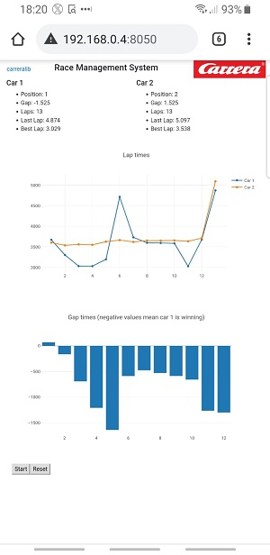

# Dash-based Carrera Race Management System

After playing some rounds at home with our new Carrera slot racing track, this weekend I decided to tackle the project to build a Race Management System. The idea is having some display in the middle of the rack that shows relevant position to the drivers.

The architecture I went for is a server connected to the Carrera system via its [AppConnect](https://www.carrera-toys.com/en/product/20030369-carrera-appconnect) Bluetooth interface, and this server publishing a real-time dashboard over web. This way, any system like a tablet or a smartphone with a web browser can be used as display in the race. Here an example screenshot of my smartphone during a test race:

## Interfacing to Carrera track

Here I am standing on the shoulders of giants: using the fantastic Python library [carreralib](https://github.com/tkem/carreralib) by [Thomas Kemmer](https://github.com/tkem), developed using the great work by Stephan Heß aka [slotbaer](https://www.slotbaer.de)).

## Serving a real-time dashboard over HTTP

For this part I went for [dash](https://dash.plotly.com/), a web server based on Flask that makes the building of real-time sites a piece of cake. I configured an interval of 60 seconds for the display (that tablet or smartphone next to the track showing the real-time data) to update its values, which seems to be easy to take for the Carrera track (1 request per minute). If using multiple displays, you might want to reduce the update interval, otherwise the Carrera track will not cope with simultaneous requests and you might get some error message.

## Limitations

I built this in one weekend, so please be forgiving with the many limitations and optimization possibilities.

* We only have 2 cars, so that is what the app supports today
* We do not have a pit stop lane yet, so no way to test fuel. That is probably the next thing to do!
* Real-time optimization: improving the way that graphs are built would probably contribute to the app being more real-time. Still, one second is good enough for me
* Start traffic light: I want to look at how to build this, but I had no time yet

Feel free to contribute if you would like this project to be expanded!

Carrera and Carrera AppConnect are registered trademarks of Stadlbauer Marketing + Vertrieb GmbH.
